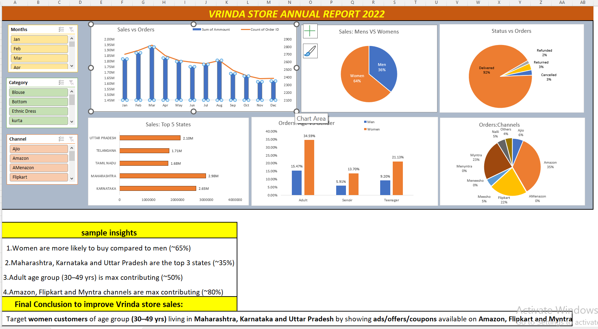

# Vrinda Store Annual Report 2022

## 📊 Project Overview
This project presents an interactive Annual Sales Dashboard for Vrinda Store (2022), built entirely in Microsoft Excel.  
The dashboard provides insights into sales performance, customer behavior, order status, channels, demographics, and regional trends, helping stakeholders make data-driven decisions.

## 🎯 Objective
- Analyze Vrinda Store's 2022 sales data
- Identify key customer segments
- Understand top-performing states and sales channels
- Track monthly sales and order trends
- Provide actionable insights to improve overall sales performance

## 🛠 Tools & Techniques Used
- Microsoft Excel
- Power Query
- Data Cleaning & Transformation
- Pivot Tables & Pivot Charts

## 📈 Key Analysis
- **Sales vs Orders** – Number of orders and revenue from Jan to Dec  
- **Sales by Gender** – Women contribute ~65% of total sales, men ~36%  
- **Order Status Analysis** – 92% orders successfully delivered  
- **Top 5 States by Sales** – Maharashtra, Karnataka, Uttar Pradesh, Tamil Nadu, Telangana  
- **Orders by Age & Gender** – Adult age group (30–49 yrs) is the highest contributing segment  
- **Sales Channels** – Amazon, Flipkart, and Myntra contribute ~80% of total orders  
- **Interactive Filters** – Month, Category (Blouse, Bottom, Ethnic Dress, Kurta), Channel (Amazon, Flipkart, Ajio, etc.)

## 💡 Key Insights
- 👩 Women are more likely to purchase compared to men (~65%)  
- 📍 Maharashtra, Karnataka, and Uttar Pradesh are the top 3 revenue-generating states  
- 👥 Adult customers (30–49 yrs) are the largest customer segment  
- 🛒 Amazon, Flipkart, and Myntra are the most effective sales channels  
- ✅ **Business Recommendation** – Target women customers aged 30–49 years in Maharashtra, Karnataka, and Uttar Pradesh by running ads, offers, and discount coupons on Amazon, Flipkart, and Myntra

## 📊 Dashboard Preview

## 👩‍💻 Author
Shubhangi P. Nawale  
Aspiring Data Analyst | Excel | Power BI | SQL
